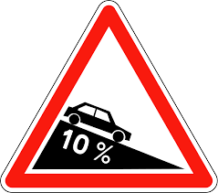

## Optimisation numérique
# Optimisation du profil d’une route
Projet donné par le Prof. [Marie Postel](https://www.ljll.math.upmc.fr/postel/).

## Partie I:Excursion en dimension infinie

On considère une première approche simplifiée du problème du profil d'une route de longueur L. On construit la route en faisant uniquement des tranchées et des talus ; le tracé est supposé donné, seules la profondeur des tranchées et la hauteur des talus (i.e. le profil de la route) sont à définir.

## Partie II. Retour à la dimension finie : l’approximation du problème.

## Partie III. Mise en oeuvre numérique avec Scilab.

*Novembre 2017*
